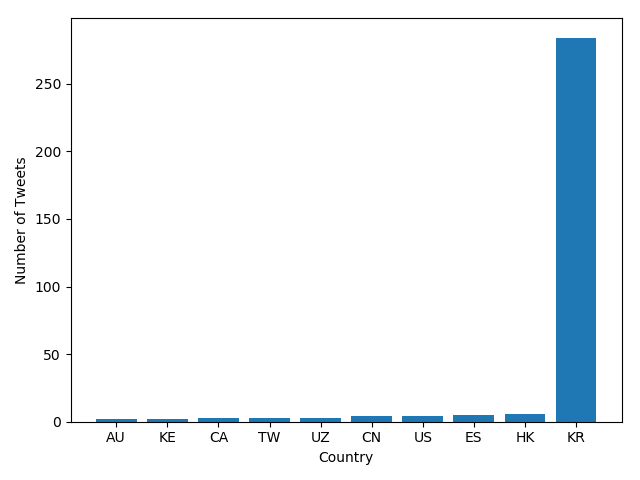
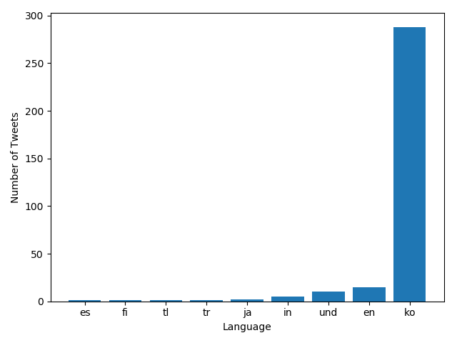

# Tracking the Coronavirus on Twitter in 2020

In this project, I scanned through all geotagged tweets sent in 2020 to monitor for the spread of the coronavirus on social media. This project allowed me to:

- work with large scale datasets (~3.3 terabytes)
- work with multilingual text
- utilize the MapReduce divide-and-conquer paradigm to create parallel code
- better understand global perceptions of the coronavirus in the early stages on the pandemic

## Background

Of the approximately 500 million tweets sent everyday, only 2% are *geotagged*. Geotagged tweets contain location information about where the tweets were sent from.
The dataset I used for this project contains all geotagged tweets sent in the year 2020 -- about 1.1 billion tweets in total.

The tweets for each day in 2020 are stored in zip files with the following name format: `geoTwitterYY-MM-DD.zip`. Inside each of these zip files are 24 text files, one for each hour of the day, that contain a single tweet per line in JSON format.

## Project Motivation

Let's say we wanted to simply count the number of tweets sent on a particular day. We could use the following command:

```
unzip -p '/data/Twitter dataset/geoTwitter20-01-01.zip' | wc -l
```

However, the file is so large that looping over it and counting the number of lines takes a very long time -- about 80 seconds on average for me. So, how long would it take for us to loop over the entire dataset?

```
$ echo "print(1887*80/60/60)" | python3
41.93333333333333
```

Based on this, we can predict that it will take about 42 hours just to loop over the entire dataset! Because looping has a runtime of $O(n)$, an algorithm with $O(n^2)$ runtime would take about 73 days to complete. Therefore, it's very important that any algorithms we perform on this dataset have runtime $O(n)$. 73 days is just way too long to sit around waiting for code to finish!

However, we can't let this runtime issue prevent us from digging into this dataset and searching for insights about the spread of coronavirus in 2020. Usually, datasets that contain key insights are quite large. So, we need better ways of dealing with large scale data... introducing: MapReduce.

## MapReduce

MapReduce is a widely used 3-step procedure for large scale parallel processing. The general flow of the MapReduce procedure is as follows:

1. **Partition**: we partition the data into subsets.
2. **Map**: we apply a mapping to the subsets that performs some determined operation.
3. **Reduce**: we merge the outputs generated by the mappings, allowing us to have a single output file by which we can perform analysis on. 

The following image helps to visualize the MapReduce process:


The main benefit of MapReduce is that we can run the computationally expensive mapping tasks in parallel, significantly reducing runtime. 

Now that we've introduced the MapReduce model, let's cover each of the steps in a bit more detail. Note that the partition step was completed in the creation of the dataset, as the tweets are already split into one file per day.

## Method

**Mapping**

The `map.py` file processes the zip files for each day and tracks the usage of the loaded hashtags on both a language and country level. The hashtags we track are contained within the `# load keywords` section of the file, and displayed below:

```
hashtags = [
    '#코로나바이러스',   # Korean for Coronavirus
    '#コロナウイルス',   # Japanese for Coronavirus
    '#冠状病毒',         # Chinese for Coronavirus
    '#covid2019',
    '#covid-2019',
    '#covid19',
    '#covid-19',
    '#coronavirus',
    '#corona',
    '#virus',
    '#flu',
    '#sick',
    '#cough',
    '#sneeze',
    '#hospital',
    '#nurse',
    '#doctor',
]
```

Running `map.py` will output two files, one that ends in `.lang` for the language dictionary, and one that ends in `.country` for the country dictionary. Essentially, each file either contains the number of tweets sent from each country (in the `.country` file), or the number of tweets written in each language (in the `.lang` file). The keys of the dictionary in each file are simply the hashtags that we want to track, and the value of those keys are the number of posted tweets that contain the respective hashtag.

**Running the Mapper**

`run_maps.sh` is a shell script that loops over each file in the dataset and runs the `map.py` command on that file. Each call to `map.py` can take up to a day to finish, so I used the `nohup` command to ensure that the program continues to run after disconnecting, and the `&` operator to ensure that all `map.py` commands run in parallel. 

First, ensure that you have execute permissions:

```
chmod u+x run_maps.sh
```

Then, go ahead and run the script:

```
nohup ./run_maps.sh &
```

**Reducing the Outputs**

After `map.py` has run on all the files, a large number of files will be contained in the `outputs` folder. `reduce.py` combines all of the `.lang` files into a single file, `reduced.lang`, and all of the `.country` files into a different file, `reduced.country`. We make two calls to `reduce.py` to achieve this. Here's an example command to run `reduce.py` for the `.lang` files, using the glob operator:

```
./src/reduce.py --input_path=outputs/*.lang --output_path=reduced.lang
```

A similar command should be used to input all the `.country` files into `reduce.py` to generate `reduced.country`.

**Visualizing the Outputs**

The `visualize.py` file generates a bar graph of the results and stores the bar graph as a png file. The horizontal axis of the graph contains the keys of the input file, and the vertical axis of the graph contains the values of the input file.

First, I ran `visualize.py` with the `--input_path` equal to the country file created in the reduce phase, and the `--key` set to `#coronavirus`. This gave me an idea of which countries sent the most tweets that mentioned the coronavirus. Of course, the results are slightly skewed due to differences in population between the countries, but the result is still somewhat interesting.


We can see here that the vast majority of tweets posted in 2020 that contained `#coronavirus` were sent from the United States. India and Great Britian were the second and third largest, respectively, but had less than half as many tweets. I then created a new graph using `visualize.py` with the `--input_path` equal to the `reduced.lang` file, and the `--key` set to `#coronavirus`.


Here we see that most of the tweets posted in 2020 that contained `#coronavirus` were written in English, which is hardly surprising considering the country plot above.

Next, I wanted to experiment a bit with multilingual text, and see how the results would change for both plots. First, using `visualize.py`, I created a plot that looked for tweets sent with the hashtag `#코로나바이러스` at the country level. Note that `#코로나바이러스` is Korean for coronavirus.

| Top 10 #코로나바이러스 Tweets by Country |
|-------|
|  |

The results are as we should expect here -- the vast majority of tweets in 2020 with the hashtag `#코로나바이러스` were from Korea. We see a similar result in the plot that looks for tweets sent with the hashtag `#코로나바이러스` at the language level, below:

| Top 10 #코로나바이러스 Tweets by Language |
|-------|
|  |

Of course almost all the tweets in 2020 with the hashtag `#코로나바이러스` were written in Korean, beacause, well... `#코로나바이러스` is Korean!

If anything, the last two plots above serve as a clear indication that our `map.py` and `reduce.py` files are working properly :)

**Alternative Reduce**

Recall that the main goal of this project is to monitor for the spread of the coronavirus on social media. While the above plots are interesting, they haven't helped us achieve this goal. Really, what we want is a way to visualize the speed at which the pandemic emerged, and global perceptions of the pandemic over the course of the year. We can do this by searching for tweets with given hashtags across time, and keeping track of the number of hashtag matches every day in 2020.

The `alternative_reduce.py` file takes as input a list of hashtags, and outputs a line plot where:

- there is one line per input hashtag
- the x-axis is the day of the year
- the y-axis is the number of tweets that use that hashtag during the year

Essentially, `alternative_reduce.py` is a combined version of the `reduce.py` and `visualize.py` files. First, we scan through all of the data in the `outputs` folder created by the mapping step, and construct a new dataset that contains the information we want to plot. Then, after extracting this information, we simply create a plot of the data.

First, I specifically wanted to visualize the spread of coronavirus. So, I called `alternative_reduce.py` and inputted the following hashtags: `#coronavirus`, `#corona`, and `#covid19`. Of course, there are many more hashtags that could be used to talk about coronavirus, but using these three provided a satisfactory result:


This plot is really cool. Thinking back to March of 2020, coronavirus was a really new, scary thing that everyone was talking about. This plot shows just that.

Next, I was curious if tracking other hashtags that are a bit more loosely related to the coranavirus itself could also provide insights into the spread of covid. Would hashtags like `#doctor`, `#nurse`, `#flu`, and others also show the speed at which the pandemic took over in March of 2020? Or would we also see normal year-to-year spikes of people talking about health related things (for example, in flu season)? Take a look:


While this plot looks cool, I don't think it really tells us much. We do see some drastic spikes at various points, but these look like single day outliers. Maybe we could say that the magnitude of these spikes is generally greater in the earlier months of 2020 (which is probably true), but I think it would be a bit of a stretch to try and make any firm claims from that. The data just looks messy throughout. Well, it was worth a try!

## Conclusion

In this project, I utilized the MapReduce model to scan through 1.1 billion tweets sent in 2020, with the goal of monitoring for the spread of the coronavirus on social media. I generated a few plots to visualize the data that I gathered, and drew some valuable insights.

The first four graphs didn't reveal anything surprising. Essentially, `#coronavirus` was mainly included in English tweets from English-speaking countries. The Korean translation of coronavirus, `#코로나바이러스`, was used at a lower rate and almost exclusively in Korean tweets sent from Korea. The main benefit of these graphs was that they allowed me to verify that my Map and Reduce steps were generating valid outputs.

The most interesting findings are contained within in the last two line plots. Mainly, in the first plot we can see the speed at which the coronavirus spread, and captured people's attention. We see a small spike in coronavirus-related hashtag usage in late Feburary, followed by a massive spike in keyword hits during the first few weeks of March. This accurately reflects how the pandemic actually developed -- first with some talk of the initial reported cases in China, followed by the first cases in the US, country-wide lockdowns, and wide-spread panic. 

Additionally, we also see that the number of tweets that mentioned coronavirus does not allign with the number of daily cases in the US and abroad. After the initial spike in March, the number of tweets that mentioned coronavirus remained relatively low. Even though the pandemic generally worsened after March of 2020, I presume this is due to people focusing their attention away from covid as it became more "normal."

These are just a few of the insights that could be drawn from the analysis above. In future work, I think it would be interesting to track the spread of coronavirus in different locations across time, and compare the volume of those tweets to the actual coronavirus case numbers in those locations.
